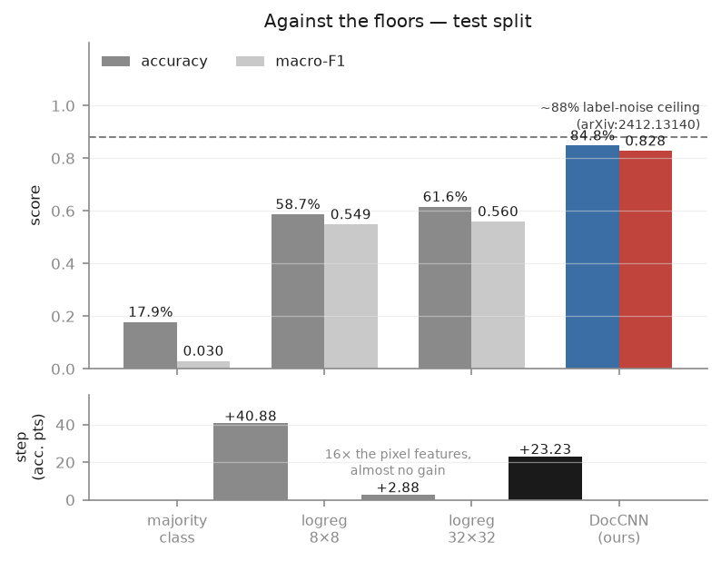
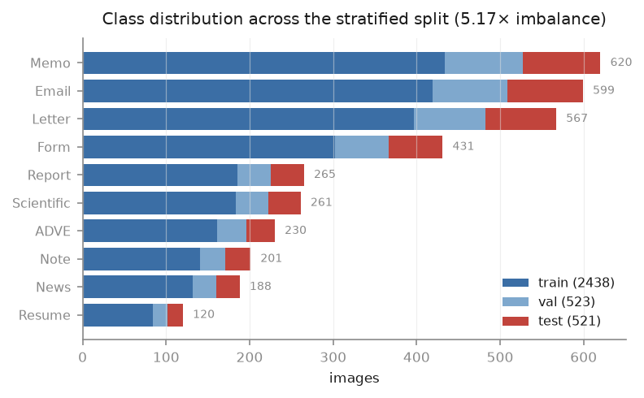
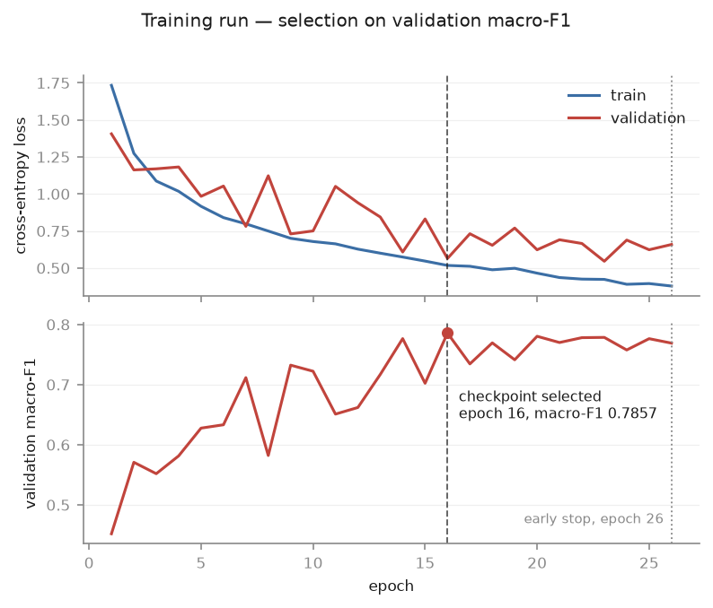
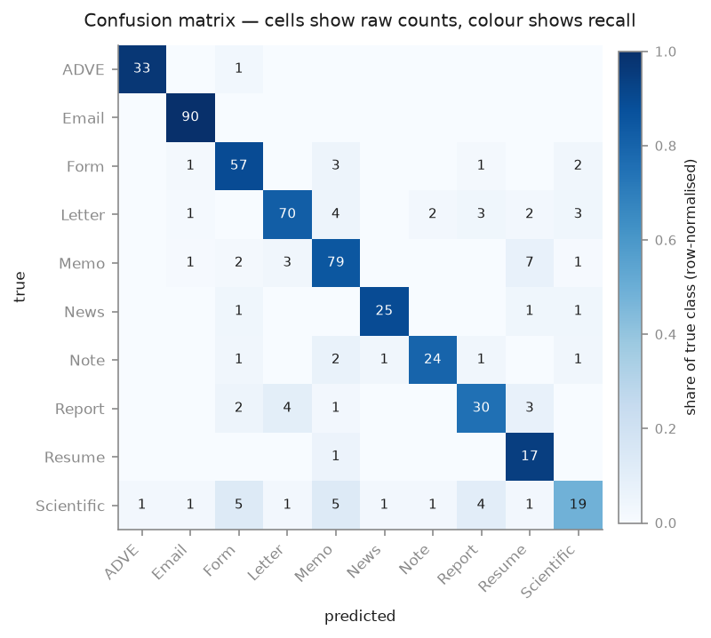
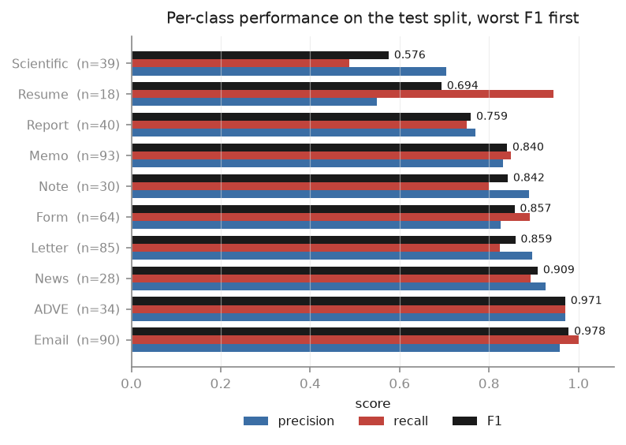

# Document Image Classification — a CNN built from scratch

A convolutional network that sorts scanned documents into ten types — memo, letter, form,
resume, advertisement, email, news article, note, report, scientific — trained on
[Tobacco-3482](https://huggingface.co/datasets/maveriq/tobacco3482). Everything is
hand-written in PyTorch: the architecture, the training loop, the evaluation, the metrics, the
near-duplicate detection, and the statistics used to interpret the results. No pretrained
weights, no transfer learning, no high-level training wrapper. I built this over a weekend to
close a specific gap — my previous computer-vision project was an adapted YOLOv8 repository
that worked without my being able to explain most of it. The goal here was understanding, not
leaderboard position, so the project is organised around measuring things rather than
maximising a number.

## Results

| Model | Test accuracy | Macro-F1 |
|---|---|---|
| Majority class (always predict Memo) | 17.85% | 0.0303 |
| Logistic regression, 8×8 pixels (64 features) | 58.73% | 0.5491 |
| Logistic regression, 32×32 pixels (1024 features) | 61.61% | 0.5599 |
| **DocCNN — 1.20M parameters, from scratch** | **84.84%** | **0.8282** |

Both linear baselines use `StandardScaler` fit on the training split only, with `C` tuned on
validation and `class_weight="balanced"`; both selected C=0.1. Sixteen times more pixel
features bought logistic regression just **+2.88 points**, which means both linear models are
reading roughly the same thing — coarse ink distribution by region. That is what makes the
CNN's **+23.2 point** margin over the stronger baseline meaningful: it cannot be explained by
having access to more pixels.



The lower panel is the point: the step from a majority-class guess to a linear model on 8×8
pixels is +40.88 accuracy points, the step from 8×8 to 32×32 is +2.88 despite sixteen times the
features, and the step from there to the CNN is +23.23.

A 2024 audit of this dataset ([arXiv:2412.13140](https://arxiv.org/abs/2412.13140)) found 11.7%
of labels are wrong and 16.7% of documents carry more than one valid label, which puts a
practical ceiling near 88%. Reviewing the thirty errors the model was most confident about, six
were label errors where the model was right, thirteen were genuinely ambiguous, and eleven were
real model errors — so most of the remaining gap is not closeable by better modelling.

Macro-F1 came in 2.4 points below accuracy rather than the 5–10 points expected on a dataset
with 5.17× class imbalance. The inverse-frequency loss weighting is why, and its cost is visible
in the rarest class: Resume reaches 0.944 recall at 0.548 precision, meaning the model
over-predicts it. That is the trade the weighting was chosen to make.

## Setup

Tobacco-3482 holds 3,482 grayscale scans across ten classes, distributed unevenly — 620 memos
against 120 resumes, a 5.17× spread. Source images are large, a median of 2386×2292 pixels, and
their aspect ratios range from 0.68 to 1.64, so some documents are landscape. Before splitting,
perceptual hashing groups near-duplicates so that no cluster straddles a split boundary; the
split itself is stratified at 70/15/15, giving 2,438 training, 523 validation and 521 test
images with every class within 0.2% of its target proportion.



Preprocessing resizes the long side to 256, pads the short side to square with white, and caches
the result as a 217.6 MB uint8 array. Training crops randomly to 224 and applies rotation, small
affine jitter and brightness/contrast changes — every geometric transform with `fill=255` to
match the padding. Evaluation uses a deterministic centre crop. Normalisation constants
(mean 0.9351, std 0.1726) are computed from the training split over content pixels only.

Training uses cross-entropy with inverse-frequency class weights, AdamW at 3e-4 with weight
decay 1e-4, cosine annealing, and batch size 32. Checkpoints are selected on validation
macro-F1. The reported run stopped early at epoch 26 of 40 and took 16 minutes at 36.8 seconds
per epoch on an M2 MacBook Air with 8 GB of memory.



Validation loss is noticeably noisier than training loss, which is expected on a 523-image
validation split — a handful of images changing prediction moves the metric visibly.

## Architecture

Four VGG-style blocks, each `[Conv3×3 → BatchNorm → ReLU] ×2 → MaxPool(2)`, halving the spatial
size and doubling the channels at every stage:

```
input     1 × 224 × 224     grayscale
block 1  32 × 112 × 112
block 2  64 ×  56 ×  56
block 3 128 ×  28 ×  28
block 4 256 ×  14 ×  14
pool    256 ×   3 ×   3     3×3 average pool — keeps coarse spatial position
head              10        Dropout(0.5) → Linear(2304 → 10), raw logits
```

**1,172,640** backbone parameters plus **23,050** in the head, **1,195,690** total. The model is
deliberately small: with 2,438 training images and no pretrained initialisation, memorisation is
a bigger risk than insufficient capacity. VGG11's classifier head alone is about 119.6M
parameters, roughly 5,000× this entire network.

The convolutions use `bias=False`. BatchNorm's first operation subtracts the batch mean, so
`(x + b) − mean(x + b) = x − mean(x)`: a convolution bias cancels exactly, its gradient is
identically zero, and it cannot learn anything. BatchNorm's own `beta` provides the offset
instead.

The head pools to 3×3 rather than 1×1 because global average pooling discards where things are
on the page, and page layout carries much of the signal for this task. The theoretical receptive
field after the fourth block is 76 pixels, 33.9% of the input, so a late-layer unit sees a patch
rather than a page — global layout enters the model through the pooling grid, not through the
receptive field.

## Where the errors are



Email is essentially solved at 90/90 recall. The interesting row is Scientific, whose 19
correct predictions out of 39 are matched by errors **spread across nine other classes** — five
to Form, five to Memo, four to Report, and single instances almost everywhere else. That
dispersion is itself evidence: a class confused with one or two neighbours usually shares a
visual template with them, whereas a class confused with everything has no visual signature of
its own to be confused about.



Resume is the clearest illustration of what the class weighting does. Its recall is 0.944
against a precision of 0.548 — the model finds nearly every resume and pays for it by labelling
other documents as resumes. With 18 test examples of the rarest class, that is the trade the
inverse-frequency weighting was chosen to make.

## What the R&D found

**A leakage bug that the reported number corrects for.** The raw test accuracy was 85.22%, which
crossed a >85% threshold set during planning specifically as a leakage tripwire. Index overlap,
hash-group overlap and byte-identical checks were all clean, but re-hashing the 256×256 cached
tensors — the representation the model actually consumes — found 13 test images (2.5%) within
perceptual-hash distance 3 of a training image, four of them at distance 0. The deduplication had
hashed the *original* scans; at roughly 9× downscaling, pairs that were 4–12 bits apart as
originals collapse to identical hashes. Excluding those images gives 84.84% / 0.8282, which is
the figure reported everywhere here.

**Padding distorted the normalisation statistics.** White padding accounts for 23.4% of cached
pixels, and the amount varies per image with aspect ratio. Including it shifted the mean toward
white and deflated the standard deviation by 11%, from 0.1726 to 0.1535 — which would have
under-normalised the real document content. Statistics are computed over content pixels only,
tracked by a stored content rectangle per image.

**The deduplication threshold chained across near-blank pages.** At Hamming distance 5, the
largest "near-duplicate" cluster held 121 images with a median internal distance of 14 — nearly
three times the threshold. They were different emails that shared only a sparse layout, linked
transitively through union-find. Cluster members averaged 0.018 ink density against 0.124 for the
rest of the dataset; perceptual hashing thresholds DCT coefficients against their median, so on a
near-blank page the bits flip on scanner noise. Threshold 3 was adopted, which drops the affected
fraction from 7.4% to 3.3%.

**A test that passed for the wrong reason.** The single-batch overfit sanity check initially drew
its eight images from consecutive dataset indices. Because split indices are sorted, all eight
were the same class, so "memorise eight images" collapsed into "always predict class 0" — a
constant function reachable by pushing one logit up. It printed PASS in five steps and could not
have detected misaligned labels, which is one of the specific bugs the check exists to catch.

**The Scientific class may be unreachable by vision alone.** It scores 0.576 F1 with 0.487
recall, the worst of the ten, and accounts for six of the twelve most-confident errors. Looking
at the images, the class contains a research letter, a numeric data table, a contract cover
sheet, a poster, handwritten lab notes and a research proposal — documents that share subject
matter but no page geometry, while every other class here is layout-defined. This is stated as a
hypothesis, not a finding: the pending pooling ablation tests it by reporting per-class F1 across
four arms that span no spatial grid to a 7×7 grid.

## Testing

Layer shapes, per-arm parameter counts and the pooling approximation are asserted in
`tests/test_shapes.py`, which fails if any of them drift. Checkpoint round-trip and resume
continuity are covered by `tests/test_checkpoint.py`, which confirms that a full checkpoint
resumes bit-identically (0.000e+00 deviation) where a weights-only checkpoint diverges by
2.079e-02.

Single-image inference was verified **manually**, not automatically: `scripts/predict.py` was run
end to end on test-set images with the preprocessing path confirmed identical to the evaluation
path used in training, and the script asserts that the normalisation constants were computed with
padding excluded. There is no automated test covering inference, and no coverage measurement for
the repository as a whole.

## What's next

The pooling ablation is designed, pre-registered in `configs/ablation.yaml`, and instrumented,
but **has not been run**. It compares four heads on an identical backbone: 1×1 pooling (2,570
head parameters), 1×1 pooling plus a hidden layer sized to match (22,972), 3×3 pooling (23,050)
and 7×7 pooling (125,450). The second and third differ by 0.34% in capacity and only in whether
spatial position survives to the classifier, which is what isolates the variable. The primary
comparison uses McNemar's exact test on the shared test set at an unadjusted α=0.05, with the
other five pairs treated as exploratory under Holm correction, and every difference read against
a seed-variance floor measured separately. With 521 test images the detectable difference is
about 3.4–4.8 points against an expected effect of 2–3, so an inconclusive result is a live and
legitimate outcome.

Planned beyond that: a detection head for logos, signatures, stamps and tables, written from
scratch before comparing against YOLO; OCR over detected regions; a text branch fused with the
image signal, motivated directly by the Scientific-class hypothesis above; and a serving API.
All four are planned, none started.

## Reproduction

```bash
git clone https://github.com/Harsh020802/document-classification-cnn-from-scratch.git
cd document-classification-cnn-from-scratch

conda create -n docclf python=3.11 -y
conda activate docclf
pip install -r requirements.txt
export PYTHONPATH=.

python scripts/01_inspect_data.py      # download and verify the dataset
python scripts/02_dedup_and_split.py   # perceptual-hash dedup, then stratified split
python scripts/04_build_cache.py       # 256×256 cache + normalisation statistics
python scripts/08_baselines.py         # the three baselines (~2 s)
python scripts/09_train.py             # full training run (~16 min on an M2)
python scripts/10_error_analysis.py    # confusion matrix and confident errors
```

Then predict on a single image:

```bash
python scripts/export_samples.py --n 20     # export browsable JPEGs to samples/
python scripts/predict.py samples/<file>.jpg
python scripts/predict.py --test-index 0    # or go straight by test-set position
```

`./run.sh <script> [args]` runs any of these with the environment and `PYTHONPATH` set, if you
would rather not activate anything. Total time from a clean clone is roughly 25 minutes, most of
it the dataset download and the training run.

Three scripts exist purely to make the mechanics visible, printing real values from real forward
passes rather than annotated comments: `05_shape_walkthrough.py` (tensor shape at every layer),
`06_gradient_demo.py` (a gradient going from `None` to populated, weights moving, and what
happens when `zero_grad()` is removed), and `07_eval_demo.py` (`train()` versus `eval()` on an
identical batch, and what `no_grad()` saves).

## Repository layout

```
src/data/       dataset, transforms, stratified splitting, perceptual-hash dedup
src/models/     the CNN — backbone and head kept separate for later reuse
src/engine/     training loop, metrics, checkpointing
src/utils/      device selection, seeding, plotting
scripts/        numbered in execution order, 01 through 13, plus predict.py
tests/          shape and checkpoint assertions
configs/        default.yaml and the pre-registered ablation.yaml
notes/          the design record
outputs/        figures, metrics and per-run results (checkpoints are not committed)
```

All five figures regenerate from files on disk with `./run.sh scripts/make_figures.py` — no
number is hand-typed into the plotting code, so they rebuild correctly after any new run.

`notes/` is the part of this repository I would point at first. `DECISIONS.md` is an
append-only log of every non-obvious choice with its reasoning and arithmetic, including the
ones that turned out to be wrong — reversals are recorded as new entries that supersede the old
ones rather than by editing history. `JOURNAL.md` is the session-by-session lab notebook,
`RESULTS.md` holds every measured number with the configuration that produced it, and
`SUMMARY.md` is the two-page version.
