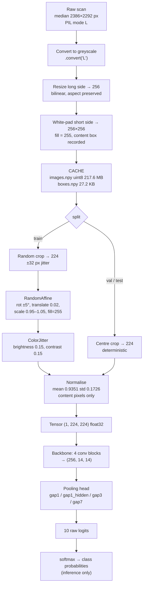
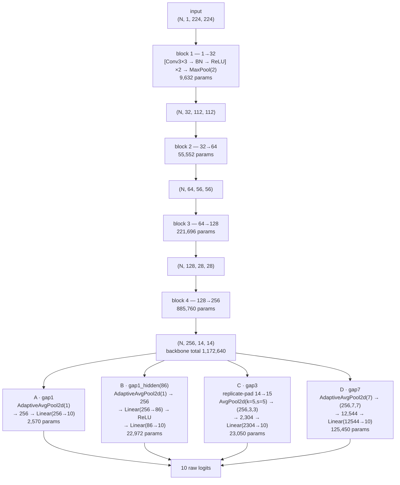
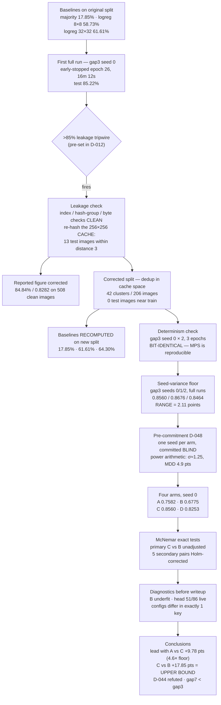

# Document Image Classification — the full project record

This is the long-form companion to the [README](../README.md). The README is the front door:
what was built and what it scored. This document is the whole account — what the problem was,
how each piece of the pipeline works and why it is shaped that way, what the experiments
measured, and which of our beliefs turned out to be wrong.

It is written to be read cold. No prior context is assumed, and terms are explained the first
time they appear. Every number in it comes from a file in this repository —
[`notes/DECISIONS.md`](../notes/DECISIONS.md), [`notes/JOURNAL.md`](../notes/JOURNAL.md),
[`notes/RESULTS.md`](../notes/RESULTS.md), the JSON files under [`outputs/`](../outputs/), the
run logs, or the source itself. Nothing is estimated, remembered, or borrowed from general
practice.

---

## Contents

1. [What this is](#1-what-this-is)
2. [The pipeline, end to end](#2-the-pipeline-end-to-end)
3. [The data work](#3-the-data-work)
4. [The model](#4-the-model)
5. [Training](#5-training)
6. [Verification](#6-verification)
7. [Results](#7-results)
8. [The ablation](#8-the-ablation)
9. [What we got wrong](#9-what-we-got-wrong)
10. [Open questions](#10-open-questions)
11. [Roadmap](#11-roadmap)

---

## 1. What this is

### The problem

Given a scanned page — a photocopy of a business document, digitised decades ago at whatever
quality the scanner of the day managed — decide which of ten kinds of document it is: memo,
letter, form, resume, advertisement, email, news article, note, report, or scientific paper.

The input is a single grayscale image. There is no text extraction, no metadata, no filename
hint. The model sees pixels and nothing else.

### The dataset

[Tobacco-3482](https://huggingface.co/datasets/maveriq/tobacco3482), 3,482 scanned pages from
the Truth Tobacco Industry Documents archive, distributed across the ten classes above. It was
chosen over the alternatives for concrete reasons recorded in D-001: RVL-CDIP, the obvious
larger option, is 38.8 GB against 21 GB of free disk — it was out of scope before time entered
the calculation. DocLayNet, PubLayNet, FUNSD, SROIE and CORD are detection and extraction tasks
rather than classification, and were deferred to later phases.

The size is the point. At roughly 3.5k images a full training run takes about 16 minutes on the
hardware used here, which is the right regime for learning: short enough that you can break
something and see the result before losing the thread.

Two properties of this dataset shaped nearly every decision that followed.

**It is imbalanced.** 620 memos against 120 resumes, a 5.17× spread. This is treated as a
feature rather than a nuisance (D-001) — it forces the question of why raw accuracy misleads,
and makes per-class precision and recall the numbers you actually have to read.

**Its labels are known to be wrong at a measurable rate.** A 2024 audit,
[Label Errors in the Tobacco3482 Dataset](https://arxiv.org/abs/2412.13140) (WACV 2025), found
**11.7%** of the dataset improperly annotated and **16.7%** carrying more than one valid label.
That sets a practical ceiling near **88%** accuracy. This was recorded at the start, deliberately,
so that a plateau below 100% would not be misread as a broken architecture. Data quality caps
model quality, and no change of architecture rescues bad labels.

### Why this project existed

The stated goal was understanding, not benchmark position (D-001). It exists to close a specific
gap: a previous computer-vision project was an adapted YOLOv8 repository that worked without the
author being able to explain most of it. So everything here is hand-written — the architecture,
the training loop, the metrics, the near-duplicate detection, the statistics used to read the
results. No pretrained weights, no transfer learning, no high-level training wrapper.

That constraint is load-bearing rather than decorative. With no pretrained initialisation and
~2,400 training images, the dominant risk is overfitting rather than insufficient capacity
(D-002), and that single fact explains the small model, the aggressive dropout, the strong
augmentation, and the refusal to adopt VGG11's classifier head — which alone is ~119.6M
parameters, roughly 5,000× this entire network (D-003).

### What it is not

**It is not a leaderboard attempt.** Published Tobacco-3482 results generally use ~100 images
per class (~800 training images) and ImageNet-pretrained backbones. This project uses a 70/15/15
split giving ~2,400 training images — 3× the data, on a different protocol, with no pretraining.
The numbers are not comparable in either direction, and the published-baseline comparison was
dropped for that reason (D-012). The reference points used instead are three trivial baselines
computed on this project's own split, described in [§7](#7-results).

Two corrections are recorded around this point, one in each direction (D-012). An initial claim
that ">80% would be suspicious" was benchmarked against the wrong protocol and was wrong. The
counter-claim that 80% might be cleared legitimately was also overstated, because published ~85%
figures come from pretrained backbones and more in-domain data does not fully substitute for
pretrained low-level features.

---

## 2. The pipeline, end to end

The clearest way to explain the system is to follow one image from the raw archive scan to a
prediction. Every stage below is in the source; the file is named at each step.



**Greyscale.** The source images are already PIL mode `L` — all 200 sampled in the initial
inspection were (RESULTS §2). The `.convert("L")` in `resize_and_pad` is therefore a no-op safety
net rather than a conversion. The decision to work in one channel (D-005) is recorded with a
correction attached: the original justification, that it cuts the first layer's parameters by
3×, is false in any meaningful sense — 864 params versus 288 is a 576-parameter difference out
of 1.2M, or 0.05%. The real reasons are memory and dataloader throughput on an 8 GB machine, the
fact that the scans carry no colour signal anyway, and that a memo and a letter are both black
text on white paper.

**Resize the long side to 256, pad the short side to square with white.** Not a direct resize to
a square, which would squash the page. The damage from squashing is not the distortion itself —
a CNN can learn a consistently distorted space — but that **the distortion factor varies per
image with source aspect ratio** (D-007). Measured aspect ratios in this corpus span 0.68 to
1.64, a 2.4× spread, and 0.68 means genuinely landscape documents (D-029). Squashing would
inject a per-image-varying geometric noise onto exactly the layout signal the model is meant to
read. White padding was chosen over black because white matches the document background and
reads as "more margin," a variation real scans already show; black would create a hard
artificial edge for early filters to latch onto.

**Cache at 256×256 as uint8.** The cache stores the deterministic part of preprocessing once
(`scripts/04_build_cache.py`), measured at exactly the predicted 217.6 MB and built in 37
seconds. Alongside it, `boxes.npy` stores four int16 per image — the `(left, top, w, h)`
rectangle where the real document sits inside the square canvas — at 27.2 KB.

Caching at 256 rather than at the model's 224 is deliberate (D-009): caching at 224 and then
augmenting would resample already-downscaled pixels twice, and detail lost in the first pass
cannot return. The extra cost is 256²/224² = 1.306×.

**Random crop to 224 at load time.** The split between what is cached and what is random is the
central design point of the data path. Deterministic work is cached; random augmentation happens
per epoch at load. Caching augmented images would defeat augmentation entirely — the model would
see the same 2,438 fixed variants every epoch.

The 256→224 random crop also provides ±32 px of translation jitter for free, which is realistic:
real scans vary in page position. A tension is recorded here rather than hidden (D-009): random
cropping is a translation augmentation, and one of this project's experiments rests on the
premise that *absolute* spatial position carries signal — so the jitter partially erodes what
that experiment tests. It was kept anyway, on the grounds that a spatial win *despite* jitter is
the stronger and more honest result, and a model needing pixel-exact registration would be
overfit to a scanner artifact.

Evaluation uses a deterministic centre crop instead. A random crop at evaluation time would make
the metric non-reproducible between runs, which would break the four-arm comparison outright.

**Every geometric transform uses `fill=255`.** torchvision's `RandomRotation` and `RandomAffine`
default to `fill=0` — black. Against white padding that paints maximum-contrast black wedges
into the corners, and the wedge area scales with the rotation angle, which is resampled every
epoch. That is random, class-irrelevant noise injected into the corners — and the corners are
4 of the 9 cells in the 3×3 pooling grid that the main experiment measures. Left unfixed it
would have biased that experiment *against* its own hypothesis (D-008). The value lives in one
module-level constant, `PAD_VALUE = 255` in `src/data/transforms.py`, used by both the pad and
every transform's fill, because two copies of the same magic number drift.

**Normalise with content-pixel-only constants.** Mean 0.9351, standard deviation 0.1726,
computed on the training split alone over content pixels only. The reasoning and the measured
consequences are in [§3](#3-the-data-work).

**Four convolutional blocks, a pooling head, ten logits.** Covered in [§4](#4-the-model). The
model returns raw logits with no softmax — `CrossEntropyLoss` expects logits and applies
`log_softmax` internally, so adding a softmax in the model would be a silent bug that trains,
just badly. Softmax is applied only at inference, in `scripts/predict.py`, to turn logits into
readable probabilities.

---

## 3. The data work

### Source and size

3,482 images, 10 classes — both verified against the dataset rather than assumed. The measured
class counts differ from the published table the project's research phase had recorded, and the
measured ones are used everywhere (D-028):

| Class | Published | Measured | Δ |
|---|---|---|---|
| Memo | 619 | 620 | +1 |
| Email | 593 | 599 | +6 |
| Letter | 565 | 567 | +2 |
| Form | 372 | **431** | **+59** |
| Report | 261 | 265 | +4 |
| Scientific | 255 | 261 | +6 |
| ADVE | 162 | **230** | **+68** |
| Note | 189 | 201 | +12 |
| News | 169 | 188 | +19 |
| Resume | 120 | 120 | 0 |
| **Total** | 3,482 | **3,482** | 0 |

The totals agree exactly, so the discrepancies are internal to the published table. This matters
beyond bookkeeping: inverse-frequency class weights are computed from these counts, so using the
published figures would have mis-weighted Form and ADVE by roughly 15–30%.

The source images are also much larger than the project's planning phase assumed: median
**2386×2292** pixels against an assumed ~750×1000 (D-029). That is roughly 7× the pixels per
JPEG decode, a fact that returns in [§9](#9-what-we-got-wrong).

### Class imbalance

5.17× between the largest and smallest class (620 memos, 120 resumes), against a predicted
~5.16×. Three design consequences follow, all adopted: a weighted loss, macro-F1 rather than
accuracy as the metric that selects checkpoints, and a stratified split so that a random draw
cannot hand the validation set four resumes.

### The 70/15/15 stratified split

**Stratified** means each class is divided 70/15/15 individually, so every split holds the same
class proportions as the whole dataset. Measured result: 2,438 train / 523 validation / 521 test,
with every class within **0.2%** of its target proportion.

| Class | Total | Train | Val | Test |
|---|---|---|---|---|
| ADVE | 230 | 161 | 35 | 34 |
| Email | 599 | 419 | 90 | 90 |
| Form | 431 | 302 | 65 | 64 |
| Letter | 567 | 397 | 85 | 85 |
| Memo | 620 | 434 | 93 | 93 |
| News | 188 | 132 | 28 | 28 |
| Note | 201 | 141 | 30 | 30 |
| Report | 265 | 185 | 40 | 40 |
| Resume | 120 | 84 | 18 | 18 |
| Scientific | 261 | 183 | 39 | 39 |
| **Total** | **3,482** | **2,438** | **523** | **521** |

The split also runs *before* the cache is built, not after. In the original plan the cache and
its normalisation statistics were computed at step 4 with the split at step 6 — which would have
computed "train-only" statistics over all 3,482 images, leaking validation and test pixel
statistics into the normalisation applied to training data (D-027). The effect on accuracy would
have been small, but it contradicts the config and it is the same class of leak that the sealed
test set exists to prevent. Being careful about leakage in the protocol and casual about it in
the pipeline is not a coherent position.

### Deduplication: why perceptual hashing

The same document rescanned differs in noise, skew and JPEG quantisation — different bytes,
identical content. Exact file hashing therefore catches almost nothing in a scanned corpus
(D-011). **Perceptual hashing** (`phash`) instead computes a discrete cosine transform of a
downscaled greyscale image and thresholds each coefficient against the median, producing a
64-bit fingerprint where visually similar images give similar bits. Two images are compared by
**Hamming distance** — the number of differing bits. Distance 0 means the fingerprints are
identical.

Duplicates are grouped with **union-find**, a structure that merges items into connected
components transitively: if A matches B and B matches C, all three land in one group. This is
deliberate, because near-duplicate relations are not transitive and over-merging is the safe
direction for leakage. The clustering runs *before* the split, which is what makes prevention
possible rather than mere detection — whole clusters are then assigned to a single split so no
near-duplicate straddles a boundary.

### Why threshold 3 and not 5

The initial threshold of 5 reported 39 clusters covering 256 images (7.4%). The largest single
cluster held **121 images**, labelled Email 119 / Letter 1 / News 1. That looked implausible, so
24 of them were rendered and inspected — and they are **different emails**: different senders,
subjects and body text, sharing only a layout.

The diagnosis was made by measurement rather than intuition (D-030):

- The **median pairwise distance within the cluster was 14**, nearly 3× the threshold. Most
  member pairs were not within threshold of each other at all; the cluster had formed by
  **transitive chaining** through union-find until images 30 bits apart sat in one component.
- Cluster members averaged **0.018** ink density against **0.124** for the rest of the dataset —
  **7× less ink**. This is the mechanism: phash thresholds DCT coefficients against their median,
  and on a near-blank page most coefficients sit near that median, so which side they fall on is
  decided by scanner noise rather than content. Every sparse document then hashes alike. It was
  detecting *emptiness*, not duplication.

The threshold sweep shows the cliff directly:

| threshold | clusters | in-cluster | % | largest |
|---|---|---|---|---|
| 0–1 | 7 | 18 | 0.5% | 5 |
| **3 (adopted)** | **31** | **116** | **3.3%** | **25** |
| 5 (initial) | 39 | 256 | 7.4% | **121** |
| 6 | 50 | 411 | 11.8% | 278 |
| 8 | 79 | 609 | 17.5% | 415 |

The jump in largest-cluster size from 25 at threshold 3 to 121 at threshold 4, then 278 and 415,
is the chaining onset — real duplicate counts do not grow like that. Threshold 3 sits below it.

The cost of leaving it would not have been leakage, since over-merging is conservative in that
direction. It would have been that **121 images is 20% of all 599 Emails**, locked into a single
split, so validation and test emails would have been drawn from a systematically different
subpopulation — and "7.4% near-duplicates" would have been a wrong number to publish. About half
the reported near-duplicate rate was this one artifact.

The transferable finding here is the mechanism, not the threshold value: perceptual hashing is
unreliable on sparse documents, and the diagnostic that detects it is the median *within-cluster*
distance relative to the threshold, not the cluster count or size.

**The same tool, used well, on the same data.** At threshold 3 exactly one cluster spans two
labels — 5 images at phash distance **0** from each other, labelled ADVE ×4 and News ×1.
Rendering them showed they are not documents at all: all five read "IMAGE NOT AVAILABLE ONLINE",
archive placeholder pages substituted where a scan was never digitised (D-033). A full-dataset
sweep found exactly 5, all placed in train, none in validation or test. They were kept rather
than removed.

These five are worth naming precisely, because they are a different thing from label noise.
Label noise means a document was given the wrong class — a correctable annotation problem. These
five are a **Bayes-error floor inside the dataset**: the pixels are identical across two
different labels, so *no function of the input* can separate them. That is a property of the
data, and it sits alongside the ~88% label-noise ceiling as a second, independent reason
accuracy is bounded below 100%.

### The cache-space correction

The dedup described above hashed the **original scans**. The model trains on the **256×256
cache**. Those are different questions, and the gap between them turned out to matter — it is
the leakage bug described in full in [§9](#9-what-we-got-wrong).

The corrected deduplication, run in cache space (`outputs/dedup_cachespace.json`), finds **42
clusters covering 206 images (5.9%)** and, critically, **0 test images within Hamming distance 3
of a training image** — where the original-space dedup had left 13. Split sizes are unchanged at
2,438 / 523 / 521.

One consequence must be stated because it governs which numbers can be compared with which:
**only 111 of 521 test images (21%) are shared between the old and new splits.** 410 moved out
and 410 moved in. These are substantially different test sets, so scores computed on one are
**not directly comparable** to scores computed on the other. The 84.84% figure from the first
training run belongs to the old split and is labelled as such throughout; every ablation number
belongs to the new one.

### Normalisation: train-split only, padding excluded

Normalisation rescales pixel values by subtracting a mean and dividing by a standard deviation,
so the network sees inputs in a consistent range. Two choices were made about *which* pixels
those constants are computed over.

**Train split only**, because computing them over all 3,482 images would leak validation and
test statistics into training (D-027).

**Content pixels only**, excluding the white padding (D-010). Padding is white and **the amount
varies per image with aspect ratio**, so including it pulls the mean toward white by a
per-image-varying, class-irrelevant amount. The measured effect:

| | mean | std |
|---|---|---|
| **Content pixels only** | **0.9351** | **0.1726** ← used |
| Including white padding | 0.9502 | 0.1535 |
| Difference | +0.0152 | **−0.0190** |

Padding is **23.4%** of cached pixels. The mean shift is the visible effect but the standard
deviation is the damaging one: including padding **deflates the std by 11%** (0.1726 → 0.1535),
and dividing by an under-estimated standard deviation under-normalises the real document
content. A mean of 0.935 also confirms pages are ~94% white, consistent with the ink-density
finding from the deduplication investigation.

This is computed from the stored content rectangles rather than a per-pixel mask. The first
implementation wrote a full per-pixel validity mask the same size as the image cache — 218 MB to
encode four numbers per image, doubling cache disk from 218 MB to 435 MB. Replacing it with
`boxes.npy` at 27.2 KB gave identical statistics to four decimal places (D-032).

**Class weights** are inverse-frequency, normalised to mean 1.000: Resume **2.197** at the top
down to Memo **0.425** at the bottom, a 5.2× ratio matching the imbalance. Normalising to mean 1
keeps the overall loss scale comparable to unweighted training, so the effective learning rate
does not shift with the weighting.

---

## 4. The model

`DocCNN`, defined in [`src/models/cnn.py`](../src/models/cnn.py) and
[`src/models/blocks.py`](../src/models/blocks.py). Four convolutional blocks followed by an
interchangeable pooling head.



### The block progression

Each block is `[Conv3×3 → BatchNorm → ReLU] ×2 → MaxPool(2)`, with channels doubling and spatial
size halving at every stage: 32 → 64 → 128 → 256, taking 224 → 112 → 56 → 28 → 14.

These shapes are measured from a real forward pass (`scripts/05_shape_walkthrough.py`) and
asserted in `tests/test_shapes.py` rather than annotated in a comment:

| stage | shape (N,C,H,W) |
|---|---|
| input | (8, 1, 224, 224) |
| block 1 | (8, 32, 112, 112) |
| block 2 | (8, 64, 56, 56) |
| block 3 | (8, 128, 28, 28) |
| **block 4** | **(8, 256, 14, 14)** |

VGG-style rather than a ResNet was a deliberate teaching choice (D-002): there are no skip
connections to explain away, so every layer's purpose stays visible. Two stacked 3×3
convolutions match one 5×5's receptive field with fewer parameters and an extra non-linearity
between them. MaxPool is parameter-free, and "is there a strong edge in this 2×2 window" is the
right question for documents. BatchNorm permits higher learning rates and acts as a mild
regulariser, since each sample's normalisation depends on its batch-mates.

### `bias=False`, and why BatchNorm makes that exact

The convolutions carry no bias term. The usual framing is that a conv bias is *redundant* under
BatchNorm; the sharper statement is that it is **unlearnable** (D-034).

A convolution bias adds a per-channel constant `b`. BatchNorm's first operation is to subtract
the batch mean of its input:

```
y = (x + b) − mean(x + b) = (x + b) − (mean(x) + b) = x − mean(x)
```

The `b` cancels exactly. It has no effect on the output, so its gradient is identically zero and
it can never learn anything — it is not a parameter the optimiser could use even in principle.
BatchNorm's own `beta` provides the per-channel offset instead, which is why the BN layers keep
their bias while the convolutions preceding them drop it. Carrying conv biases would mean 2,592
parameters occupying memory, appearing in every checkpoint, and consuming gradient computation
while being mathematically incapable of changing the loss.

### Parameter counts

Measured, not estimated. The backbone is **1,172,640** parameters — not the 1,175,232 carried
since the planning phase, which had assumed conv biases:

| Block | conv1 | bn1 | conv2 | bn2 | total |
|---|---|---|---|---|---|
| 1→32 | 288 | 64 | 9,216 | 64 | 9,632 |
| 32→64 | 18,432 | 128 | 36,864 | 128 | 55,552 |
| 64→128 | 73,728 | 256 | 147,456 | 256 | 221,696 |
| 128→256 | 294,912 | 512 | 589,824 | 512 | 885,760 |
| | | | | **Backbone** | **1,172,640** |

With the four heads:

| Arm | Head | Spatial | Head params | **Total** |
|---|---|---|---|---|
| A | `gap1` | none | 2,570 | **1,175,210** |
| B | `gap1_hidden(86)` | none | 22,972 | **1,195,612** |
| C | `gap3` | 3×3 | 23,050 | **1,195,690** |
| D | `gap7` | 7×7 | 125,450 | **1,298,090** |

Arms B and C are matched on head capacity to **0.3384%** — a test fails if that drifts above 1%.
The hidden width of 86 is what makes the match exact: the arithmetic solves to h = 86.29, so 86
gives 22,972 params (0.3% from C's 23,050) where 88 would give 23,506 (+2.0%). Since the arm
exists specifically to control for capacity, the tighter value wins (D-014).

Two rejected alternatives, for scale: a flatten head would be 501,770 parameters (21×), and
VGG11's classifier head is ~119.6M (~5,000×).

### Receptive field, and why the pooling grid carries global layout

The **receptive field** of a unit is the region of the input image that can influence its value.
After four blocks it is **76 pixels** — verified by the progression 6 → 16 → 36 → 76 — which is
**33.9%** of a 224-pixel input. The effective receptive field is smaller still, roughly 30–45 px.

That number is load-bearing, and it corrects an earlier claim. A block-4 unit sees a *patch*, not
a page. The original architecture plan justified itself with "document class is a global layout
property" and then chose global average pooling to 1×1 — the one head that makes global layout
**unrepresentable** (D-006). A memo and a letter both contain a header block, body text and
whitespace; pooled to a single vector they differ only in the *proportion* of local features
present, not in their arrangement.

So global layout enters this model **from the pooling grid, not from the receptive field**. In
the 3×3 head each of the 9 pooled cells averages a 5×5 region of the padded feature map,
corresponding to roughly **75×75 pixels** of input — which is what makes "letterhead at the top,
signature at the bottom" representable at all. That is the entire premise of the experiment in
[§8](#8-the-ablation), and it is why deleting spatial information at the pool is expected to be
costly.

### The `gap3` head is not textbook adaptive pooling

The operation wanted for arm C is `AdaptiveAvgPool2d(3)`. It does not run on Apple's MPS
backend: the block-4 map is 14×14, 14 is not divisible by 3, and MPS raises
`RuntimeError: Adaptive pool MPS: input sizes must be divisible by output sizes` (D-024).
`PYTORCH_ENABLE_MPS_FALLBACK=1` does **not** help — tested, identical failure. That flag routes
*unimplemented* operations to CPU, but this operation is implemented and explicitly rejects the
input, so the fallback path never engages.

The adopted implementation (D-026) replicate-pads the map from 14×14 to 15×15 and applies
`AvgPool2d(kernel_size=5, stride=5)`:

| step | shape |
|---|---|
| block4 output | (8, 256, 14, 14) — 14 % 3 ≠ 0 |
| replicate-pad 14→15 | (8, 256, 15, 15) |
| `AvgPool2d(k=5, s=5)` | (8, 256, 3, 3) |
| flatten | (8, 2304) = 256 × 9 cells |

This gives uniform cells `[0-4][5-9][10-14]`, full coverage, and no double-counting, at a cost of
+0.011 s/epoch. Its correlation with the true operation on real activations is **0.9964** as
asserted in the tests.

One caveat is recorded: the pad is `replicate`, so index 14 duplicates index 13 and the last
cell carries that column at double weight. That is a mild edge emphasis, but it *includes* the
bottom and right edges rather than discarding them. Zero-padding was rejected because it would
inject artificial dark values into a white-page region.

Why this matters more than a workaround usually would is covered in [§9](#9-what-we-got-wrong):
the first version of this fix put an implementation asymmetry inside the experiment's primary
comparison.

---

## 5. Training

All values below are from [`configs/default.yaml`](../configs/default.yaml), and the effective
runtime configs of all four ablation arms were diffed to confirm they differ in exactly one key
(D-051).

| Setting | Value |
|---|---|
| Loss | Cross-entropy on raw logits |
| Class weighting | Inverse frequency, normalised to mean 1.000 |
| Optimiser | AdamW, lr 3e-4, weight decay 1e-4 |
| LR schedule | Cosine annealing, T_max 40 |
| Epochs | 40 |
| Batch size | 32 |
| Dropout | 0.5 |
| Selection metric | `max val_macro_f1` |
| Early stopping | 10 epochs without improvement |
| Dataloader workers | 0 |

**The loss** is cross-entropy applied to raw logits, with per-class weights. The weighting exists
because the dataset is 5.17× imbalanced: unweighted, the loss is dominated by the large classes
and the model can score respectably on accuracy while ignoring Resume entirely.

**The optimiser** is AdamW at 3e-4. AdamW maintains two exponential moving averages per
parameter — one of the gradient, one of its square — and these buffers are the reason a
checkpoint is 14.4 MB rather than 4.8 MB, and the reason checkpoints must save optimiser state
rather than weights alone.

**The monitored metric is macro-F1, not accuracy** — the single most consequential choice in this
table. F1 is the harmonic mean of precision and recall; **macro**-F1 averages the per-class F1
scores with equal weight per class, regardless of class size. Accuracy weights every *image*
equally, so on imbalanced data a model can look good while failing the rare classes completely.

The baselines make this concrete in one row: the majority-class predictor, which always answers
"Memo", achieves **17.85% accuracy** but a macro-F1 of **0.0303**. The accuracy figure looks
non-trivial; the model is worthless. Macro-F1 says so.

Checkpoints are selected on validation macro-F1 and the test split is never used for selection.
A proposal to pool validation and test for evaluation — which would have halved the sampling
error — was raised and then withdrawn (D-015): because validation *selects* the checkpoint,
scoring on it is optimistically biased, and biased **differently per arm** depending on how much
each overfits the selection. That systematic error would contaminate exactly the comparison
being made, and is worse than the random error it removes.

**Dataloader workers are 0**, measured rather than assumed — see [§9](#9-what-we-got-wrong),
where the timing result refuted half the reasoning that led to the cache.

---

## 6. Verification

Before trusting any result, the pipeline was checked with tests and demonstrations that print
real numbers from real forward passes rather than asserting correctness in comments. Two of them
were themselves wrong at first, which is recorded here and in [§9](#9-what-we-got-wrong).

### Shape and parameter tests

`tests/test_shapes.py` asserts the block output shapes, the 14 % 3 constraint, the four arms'
parameter counts, the B-vs-C capacity match (0.3384%, failing above 1%), and the `Pool3x3MPS`
correlation against the true operation on real cached images (0.9964, requiring > 0.99). These
fail if any of the numbers quoted in this document drift.

### Gradient lifecycle

`scripts/06_gradient_demo.py` traces one weight tensor through one optimisation step:

| moment | `w.grad` | `w[0,0]` |
|---|---|---|
| before `backward()` | **None** | unchanged baseline |
| after `backward()` | populated, abs mean 9.957e-02 | **max abs diff = 0.000e+00** |
| after `step()` | — | every element moved by exactly **3.000e-04 = lr** |

The middle row is the one worth keeping: `backward()` computes derivatives and changes no
weights. The uniform lr-sized first step is characteristic of Adam — on step 1 the update
reduces to `lr × sign(g)` regardless of gradient magnitude.

The same script removes `optimizer.zero_grad()` to show what it does. Gradient magnitude *rises*
without it (1.686e-01 → 1.942e-01 → 2.229e-01, accumulating the sum of all prior steps) and
*falls* with it (1.686e-01 → 1.329e-01 → 8.023e-02, the model fitting the batch). Opposite
directions by step 3.

### Eval-mode demonstrations

`scripts/07_eval_demo.py` measures what forgetting `model.eval()` and `torch.no_grad()` costs
(D-041). Two calls on an identical batch deviate by **1.5492** in `train()` mode and **0.0000**
in `eval()` mode. On an untrained model, validating in the wrong mode gave 0.00% and 0.00%
against a correct 12.50%, mean 7.50% over 5 draws — and **nothing errors**. The number is quietly
wrong and varies run to run, which would also have made the four-arm ablation non-reproducible,
since every arm's validation score would be a random draw.

`no_grad` on a 32-image batch: **1569.2 MB** allocated without it, **0.0 MB** with it. The zero
is correct rather than a measurement failure — under `no_grad` intermediates are freed as soon as
they are consumed.

### The single-batch overfit test, including how it first passed for the wrong reason

The single-batch overfit test is a standard sanity check: take one small batch and train on it
repeatedly. A correct pipeline should drive the loss to near zero, because memorising eight
images is trivial. If it cannot, something is broken.

**The first version passed, and verified almost nothing** (D-037). It drew its eight images from
`train_ds[0..7]`. Because split indices are sorted, those first eight training rows are all class
0 (ADVE), so the batch was `y = [0,0,0,0,0,0,0,0]`. "Memorise 8 images" then collapses to
"always predict class 0" — a **constant function**, reachable by pushing a single logit up and
ignoring the input entirely. Loss reached 0.00021 in five steps and the demo printed PASS.

That is a passing number from a test that cannot fail. In particular it **cannot detect
misaligned labels**, which is one of the specific bugs the overfit check exists to catch: if
`x[i]` were paired with `y[j]`, a constant-output model would still score perfectly.

Rebuilt to span **8 distinct classes**, the curve becomes a real one:

| step | 1 | 5 | 10 | 25 | 50 | 300 |
|---|---|---|---|---|---|---|
| loss | 2.32377 | 0.73245 | 0.17043 | 0.00966 | 0.00118 | **0.00012** |
| accuracy | 0.00 | 0.62 | 0.88 | 1.00 | 1.00 | 1.00 |

An incidental check falls out of this: the starting loss **2.324 ≈ ln(10) = 2.303**, which is
what an untrained 10-class classifier must produce if its outputs are near-uniform. A starting
loss far from ln(n_classes) is itself a signal that something is wrong with the loss or the label
encoding.

### Checkpoint round-trip

`tests/test_checkpoint.py` confirms that a full checkpoint (weights + optimiser state) resumes
**bit-exactly** — 0.000e+00 deviation from an uninterrupted run — where a weights-only checkpoint
diverges by **2.079e-02**. It also confirms that loading a `gap3` checkpoint into a
`gap1_hidden` model **raises** rather than silently mixing ablation arms.

This test also failed for the wrong reason on its first version, described in
[§9](#9-what-we-got-wrong).

### What is not tested

Single-image inference was verified **manually**: `scripts/predict.py` was run end to end on
test-set images with the preprocessing path confirmed identical to the evaluation path used in
training, and the script asserts that the normalisation constants it loads were computed with
padding excluded. There is no automated test covering inference, and no coverage measurement for
the repository as a whole.

---

## 7. Results

### Baselines and CNN

Baselines exist because a raw accuracy figure is uninterpretable without a floor (D-013). Three
were run before the CNN, all with `StandardScaler` fit on the training split only, `C` tuned on
validation, and `class_weight='balanced'` so the comparison is not rigged in the CNN's favour.

The CNN figure below is from the first full training run, on the **original split**, with the
13 leaked test images excluded:

| Model | Features | Test accuracy | Macro-F1 |
|---|---|---|---|
| Majority class (always Memo) | — | 17.85% | 0.0303 |
| Logistic regression, 8×8 pixels | 64 | 58.73% | 0.5491 |
| Logistic regression, 32×32 pixels | 1,024 | 61.61% | 0.5599 |
| **DocCNN (gap3), 508 clean test images** | — | **84.84%** | **0.8282** |

The run: `gap3`, seed 0, 40 epochs configured, **early-stopped at epoch 26** after 10 epochs
without validation macro-F1 improvement. 16m 12s total at a median 36.8 s/epoch. Best validation
macro-F1 0.7857 at epoch 16; test loss 0.4729.

### The interpretation — why the margin means something

The important number is not 84.84%. It is that **16× more pixel features bought logistic
regression only +2.88 points** (58.73% → 61.61%).

That single comparison is what makes the CNN's margin meaningful. Both linear models are reading
essentially the same signal — coarse ink distribution by region. Documents are separable to ~59%
purely by where the ink is, at 8×8 resolution, with no notion of structure at all. Quadrupling
the resolution in each dimension barely moves that. So the CNN's **+23.2 points** over 61.61%
cannot be explained by "it had access to more pixels"; it is the margin that demonstrates the
model learned *structure* rather than *density* (D-042).

This also revised the project's own targets mid-flight. The planning-phase estimate for the
linear baselines was 30–45%, wrong by roughly 20 points. The measured floor of 61.61% sits only
8 points below the bottom of the 70–80% CNN target, which means a CNN scoring 65% would have been
a **failure** — beaten by five lines of scikit-learn — rather than a marginal pass.

### Per-class behaviour

| class | n | precision | recall | F1 |
|---|---|---|---|---|
| Email | 90 | 0.957 | **1.000** | **0.978** |
| ADVE | 34 | 0.971 | 0.971 | 0.971 |
| News | 28 | 0.926 | 0.893 | 0.909 |
| Letter | 85 | 0.897 | 0.824 | 0.859 |
| Form | 64 | 0.826 | 0.891 | 0.857 |
| Note | 30 | 0.889 | 0.800 | 0.842 |
| Memo | 93 | 0.832 | 0.849 | 0.840 |
| Report | 40 | 0.769 | 0.750 | 0.759 |
| Resume | 18 | 0.548 | 0.944 | 0.694 |
| **Scientific** | 39 | 0.704 | **0.487** | **0.576** |

Macro-F1 (0.8286 on the full test set) came in only **2.4 points below accuracy** (0.8522),
where 5–10 points had been predicted — so the class weighting worked better than expected. Its
cost is visible in the rarest class: **Resume reaches 0.944 recall at 0.548 precision**, meaning
the model over-predicts Resume, misreading 7 Memos as Resumes. That is the intended trade, and it
is visible in the numbers rather than argued for.

Class size is not what drives performance: **correlation(class size, F1) = +0.362**, a weak
positive. Scientific (n=39) scores 0.576 while News (n=28) scores 0.909. Class *definition*
matters more than class *size*.

### Where the errors come from

Of 77 test errors, the **30 the model was most confident about** were rendered and classified by
inspection into three pre-defined buckets (D-045):

| category | count | share |
|---|---|---|
| Label error — model right, ground truth wrong | **6** | 20% |
| Genuinely ambiguous — a reasonable annotator could go either way | **13** | 43% |
| Model error | **11** | 37% |
| **not the model's fault** | **19** | **63%** |

Six clear label errors, each identified by reading the page: a facsimile transmission sheet with
DATE/TO/FROM/RE labelled Form, a "WORKPLACE SMOKING BANS" poster labelled Scientific, a promotion
information sheet labelled Report, two pages headed "Inter-office Memorandum" and "INTEROFFICE
MEMORANDUM" labelled Report and Letter respectively, and a "MEMORANDUM TO: Committee of Counsel"
labelled Note.

20% label errors in this sample is consistent with the published 11.7% dataset-wide rate, since
confident errors should be *enriched* for label problems — the model is most certain when the
visual evidence is unambiguous. Combined with the 43% genuinely ambiguous cases, **most of the
remaining ~3 points to the ~88% ceiling is not closeable by better modelling**.

The 13 ambiguous cases cluster on the same boundaries the confusion matrix flags:
Scientific↔Form (a data table is both), Scientific↔Report (an interim laboratory report is both),
Report↔Letter (study summaries under a letterhead). These are genuine category overlap in the
label scheme rather than annotation sloppiness.

### Calibration

A first single-image prediction returned ADVE at **0.9999**, high enough to look suspicious. It
was checked against the full test set rather than assumed either way (D-047). Across 521
predictions the median confidence is 0.9126 and 25.5% exceed 0.99. By confidence bin:

| bin | n | mean confidence | accuracy |
|---|---|---|---|
| [0.00, 0.50) | 51 | 0.4073 | 0.3725 |
| [0.50, 0.70) | 84 | 0.6046 | 0.6786 |
| [0.70, 0.90) | 109 | 0.8239 | 0.9083 |
| [0.90, 0.99) | 144 | 0.9517 | 0.9514 |
| **[0.99, 1.00]** | **133** | **0.9974** | **0.9925** |

Expected calibration error **0.0343**, and the model is slightly *under*-confident in the mid
range rather than over-confident. In the ≥0.99 bin it is right 99.25% of the time — the
confidence is earned. The suspicious-looking number was legitimate, which required checking
rather than asserting.

---

## 8. The ablation

An **ablation** is an experiment that removes or varies one component of a system while holding
everything else fixed, to measure what that component contributes. This one asks a single
question:

> Does spatial position in the pooled head carry class signal, independent of head capacity?

### The four arms

Four classification heads on an identical backbone, differing only in whether spatial position
survives the pooling step — and, in arm B's case, deliberately not differing in capacity:

| Arm | Head | Spatial | Head params | Role |
|---|---|---|---|---|
| A | `gap1` | none | 2,570 | capacity floor |
| B | `gap1_hidden(86)` | **none** | **22,972** | matched-capacity control |
| C | `gap3` | **3×3** | **23,050** | the spatial arm |
| D | `gap7` | 7×7 | 125,450 | more resolution |

**B versus C is the experiment**; A and D are context. B exists because the original design was
confounded (D-014): a three-arm design varying only GAP 1/3/7 changes spatial resolution **and**
head capacity together, perfectly correlated. Two competing hypotheses — "spatial position helps"
and "more head capacity helps" — predict the *same* rise-then-fall curve, so the experiment had
no discriminating power at all. Three training runs that could not answer the question they were
built to ask.

One caveat was recorded before running: arm B has an extra ReLU that C lacks, so the arms are
matched on parameters but not on depth. This is unavoidable — capacity cannot be added to a
256-vector without adding a layer. It cuts in a direction that does not undermine either
conclusion: a B≈C tie would *strengthen* the capacity explanation, and a C win holds *despite*
B's slight representational edge.

### The experimental process



### The pre-registration

The hypothesis, the primary comparison, the statistical test, and the correction procedure were
all written into [`configs/ablation.yaml`](../configs/ablation.yaml) and committed to git
**before any arm was run**. Git timestamps make the hypothesis auditable as predating the data.

The primary hypothesis is stated in terms of what the test can actually support (D-022):

> The trained `gap3` model at seed 0 achieves higher test accuracy than the trained
> `gap1_hidden(86)` model at seed 0.
> **Scope:** a claim about these two fitted models, not about the architectures.
> **Architectural generalisation** is supported only if the effect exceeds the measured
> seed-variance floor.

That scoping is not a formality. **McNemar's test** — the test used here — compares two fitted
models on the *same* test images, looking only at the images where exactly one of them is right.
Images both get right, or both get wrong, carry no information about which model is better.
Comparing them as if they were independent would discard the pairing and waste power (D-017).
But McNemar treats the *test images* as the random variable and conditions on two specific
trained models. A claim about *architectures* requires treating the *training run* as the random
variable. Those are different populations, and a significant McNemar result at one seed could
reflect one lucky initialisation.

Hence a second, separate gate: the architectural claim is licensed only if the effect exceeds
what the same architecture does against itself across seeds.

**The primary comparison sits outside the multiple-comparison family** (D-020). Four arms give
six pairs; at α=0.05 each, the chance of at least one false positive is 1 − 0.95⁶ = 26.5%. The
five non-primary pairs are therefore Holm-corrected (a ladder of 0.0100 / 0.0125 / 0.0167 /
0.0250 / 0.0500). The primary is not, because pre-registering a primary and then correcting it
across all six would be having it both ways — the benefit of pre-registration is precisely that
the primary is a single planned test not subject to multiplicity.

**One seed per arm was committed blind** (D-048), before any arm result existed. The reasoning is
arithmetic: from the measured floor, σ ≈ 1.25 points, so the minimum detectable difference at 80%
power is 4.9 points at one seed, 2.8 at three seeds, 2.2 at five. Against an expected effect of
2–3 points, five hours of extra compute buys a marginally-less-weak answer rather than a strong
one. Committing this in advance is what stops the design from being conditioned on the data.

### The measured noise floor

Before comparing arms, `gap3` was trained three times changing **only the random seed**:

| seed | test accuracy | macro-F1 | Scientific F1 |
|---|---|---|---|
| 0 | 0.8560 | 0.8435 | 0.648 |
| 1 | 0.8676 | 0.8544 | 0.629 |
| 2 | 0.8464 | 0.8312 | 0.600 |
| **observed range** | **2.11 pts** | **0.0232** | **0.048** |

**This is the most important number the project produced** (D-049). The same architecture, on the
same data, with only the seed changed, varies by **2.11 accuracy points**. The effect the
experiment was designed to detect was expected to be 2–3 points. The architecture differs from
itself by about as much as it was expected to differ from its comparison arm.

Most published reports of a comparison like this state a two-point win without ever measuring
what the architecture does against itself. That is the finding, not a caveat on it.

It is reported as an **observed range**, not a standard deviation — three points do not support an
SD, which would imply a precision that does not exist (D-021).

A separate **determinism check** confirms this measures pure seed variance and not implementation
noise: `gap3` seed 0 run twice for 3 epochs gave **bit-identical** values at every epoch — train
loss 1.7377017484129795 and validation macro-F1 0.5132755559004305, matching to the last digit.
MPS is reproducible for these operations at a fixed seed.

### Results — all four arms

Seed 0, sealed test split (n=521), corrected cache-space split. Only `model.head.type` differs
across arms, verified by diffing the effective runtime configs — exactly one key.

| arm | head | spatial | head params | test acc | macro-F1 |
|---|---|---|---|---|---|
| A | `gap1` | none | 2,570 | 0.7582 | 0.7529 |
| B | `gap1_hidden(86)` | none | 22,972 | **0.6775** | 0.7001 |
| C | `gap3` | **3×3** | 23,050 | **0.8560** | **0.8435** |
| D | `gap7` | 7×7 | 125,450 | 0.8253 | 0.8188 |

### The headline comparison — A versus C

**+9.78 accuracy points from adding a 3×3 pooling grid — 4.6× the seed floor.** McNemar A–C:
b=16, c=67, p=1.4e-08. Both arms converged (best epochs 37 and 35), configs identical.

This is the result the writeup leads with because it needs no caveat. Adding coarse spatial
position to the pooled representation is worth nearly ten accuracy points on this task.

The caveat that does apply: A and C are **not** capacity-matched (2,570 versus 23,050 head
parameters), so A-vs-C alone cannot separate spatial information from head capacity. Isolating
that was arm B's job.

### The pre-registered primary — C versus B, reported as registered

| quantity | value |
|---|---|
| head params | 23,050 vs 22,972 — **0.34% apart** |
| b (C right, B wrong) | **112** |
| c (B right, C wrong) | **19** |
| discordant pairs | 131 |
| observed difference | **+17.85 accuracy points** |
| detectable at 80% power (k=2.80) | 6.15 pts |
| McNemar exact p | **3.108e-17** |
| vs 2.11-pt seed floor | **8.5× the floor** |

**And the caveat, stated in the same breath: arm B did not converge** (D-051). Its best epoch was
40 — the last one. Its train−val accuracy gap is **−0.022**, meaning validation scored *better*
than training, which is underfitting, not overfitting. Its final training loss is 2.7× arm C's.
It was still improving when the budget ran out, where A and C had both peaked before the end.

**17.85 points is therefore an upper bound on the architectural effect, not an estimate of it.**
Under a longer budget the gap would narrow. The pre-registration is left intact rather than
rewritten.

Three diagnostics were run before anything was written up, because a result 6× larger than
predicted demanded ruling out mechanical causes first:

1. **Did B train?** Yes, but it underfit — the numbers above. It did not stall at ln(10)=2.3026,
   so it was learning, just too slowly to converge in 40 epochs.
2. **Is the head alive?** Yes, partly. `Linear(256→86)` weights are normal (abs mean 0.026),
   post-ReLU activations have mean +1.58 — but **61% of activations are zero and 35 of 86 units
   are dead for every test image**, leaving 51 effective units. A degraded head, consistent with
   slow convergence, not a collapse.
3. **Are the configs identical?** Yes — diffing all four effective runtime configs found
   **exactly one differing key: `model.head.type`**. Same lr, weight decay, epochs, batch size,
   dropout, seed, normalisation constants. All four ran the full 40 epochs. The experiment is
   mechanically clean.

**What this costs the experiment, plainly:** B's non-convergence weakens the clean isolation the
design was built to provide. What survives is still informative — **B has 9× A's head capacity
and scores 8 points worse** — so capacity alone plainly does not drive the gain. But the clean
separation of spatial information from head capacity is not available from these runs.

### Secondary comparisons

Exploratory, Holm-corrected; all five significant.

| pair | b | c | p | Holm threshold | significant |
|---|---|---|---|---|---|
| B–D | 26 | 103 | 4.9e-12 | 0.0100 | yes |
| A–C | 16 | 67 | 1.4e-08 | 0.0125 | yes |
| A–B | 71 | 29 | 3.2e-05 | 0.0167 | yes |
| A–D | 28 | 63 | 3.1e-04 | 0.0250 | yes |
| C–D | 27 | 11 | 1.4e-02 | 0.0500 | yes |

### More resolution is not monotonically better

**gap3 0.8560 versus gap7 0.8253 — a 3.07-point drop** for 5.4× the head parameters and 5.4× the
spatial cells (C–D: b=27, c=11, p=0.0139). That is 1.5× the seed floor: the smallest margin in
the set and the closest to it, but a real reversal of the naive reading (D-053).

The intuition behind the whole ablation was "spatial position carries signal", and the naive
extension is "more spatial resolution is better". It is not. Going 1×1 → 3×3 gains 9.78 points;
going 3×3 → 7×7 loses 3.07.

A plausible reading, explicitly **not verified**: 49 cells over-fragment a 14×14 feature map —
each cell averages a 2×2 patch, small enough that layout elements straddle cell boundaries
inconsistently across images. 9 cells at roughly 75×75 input pixels each capture top/middle/bottom
× left/centre/right, which matches how documents are actually organised. Testing that would need
intermediate grids (4×4, 5×5), which was not in scope.

### Per-class F1 by arm

| class | A (none) | B (none) | C (3×3) | D (7×7) | range |
|---|---|---|---|---|---|
| ADVE | 0.971 | 0.943 | 0.971 | 0.985 | 0.042 |
| Email | 0.899 | 0.919 | 0.944 | 0.927 | 0.045 |
| News | 0.929 | 0.964 | 0.929 | 0.893 | 0.071 |
| Form | 0.816 | 0.773 | 0.870 | 0.849 | 0.098 |
| Note | 0.618 | 0.793 | 0.712 | 0.706 | 0.175 |
| **Scientific** | **0.485** | **0.458** | **0.648** | **0.545** | **0.190** |
| Report | 0.609 | 0.482 | 0.737 | 0.673 | 0.255 |
| Resume | 0.791 | 0.667 | 0.895 | 0.944 | 0.278 |
| Letter | 0.686 | 0.538 | 0.840 | 0.827 | 0.301 |
| Memo | 0.726 | 0.465 | 0.891 | 0.838 | 0.427 |

The pre-registered threshold for reading this table is the per-class seed floor of **0.048**.
Nearly every class moves more than that across arms, so **spatial position matters broadly**
rather than specifically for any one class. The Scientific row settled a hypothesis and is
covered in [§9](#9-what-we-got-wrong).

### Scope, stated honestly

- One seed per arm. The architectural claims rest on effects exceeding a floor measured on a
  different arm's seeds, not on replication of each arm.
- The primary comparison's headline number is an upper bound because arm B did not converge.
- Arm C's pooling is a documented approximation to `AdaptiveAvgPool2d(3)`, not the textbook
  operation (correlation 0.9964 on real activations).
- Test-set sampling variance of **1.90%** at p=0.75, n=522 is **irreducible** by running more
  seeds — the same images are evaluated every time (D-019). More seeds is never a route to
  significance here.
- Inconclusive was written into the protocol as a valid outcome (D-016). It did not arrive, but
  the headline effect being 4.6× the floor rather than 1.5× is the only reason.

---

## 9. What we got wrong

This section is not decoration. Five beliefs held during the project were refuted by measurement,
and in each case the refutation changed something. They are recorded here as they are recorded in
`DECISIONS.md` — with the original claim left standing rather than edited away.

### The overfitting explanation for arm B

**What was believed.** Arm B scored 8 points below arm A despite having 9× the head capacity. The
first explanation offered was overfitting — the extra capacity memorising the training set.

**What disproved it.** Three diagnostics, run because a result 6× larger than predicted was not
accepted without ruling out mechanical causes. **B's validation score is higher than its training
score** — train−val accuracy gap of **−0.022**. A model that has memorised its training set
cannot do that. B's final train loss is 2.7× C's, and its best epoch was **40, the last one**; it
was still improving when the budget ran out, where A and C peaked at 37 and 35.

**What changed.** The explanation reversed: B **underfit**, the opposite of what was claimed. And
the reporting changed with it — the +17.85-point primary result became an **upper bound** rather
than an estimate, and the writeup was restructured to lead with A-vs-C, which needs no such
caveat.

### D-044's modality hypothesis

**What was believed.** Scientific is the worst class (F1 0.576, recall 0.487) and accounts for 6
of the 12 most-confident errors. Looking at the images explained why: the class contains a
research letter, a numeric data table, a contract cover sheet, a smoking poster, handwritten lab
notes and a research proposal. They share **subject matter** and nothing else, where every other
class here is layout-defined. The hypothesis was that this is a **modality ceiling** — a CNN
reading page geometry has no mechanism to recognise "this document is about science" — and that
Scientific F1 would stay flat at ~0.58 across all four arms regardless of spatial resolution.

Crucially, this was recorded as **a hypothesis with a named test, not a finding**, and the
ablation was set up to settle it either way.

**What disproved it.** The ablation:

| arm | A gap1 | B gap1_hidden | C gap3 | D gap7 | range |
|---|---|---|---|---|---|
| Scientific F1 | 0.485 | 0.458 | **0.648** | 0.545 | **0.190** |

The pre-registered threshold was the per-class seed floor of **0.048**. The observed range is
**0.190 — 4× the threshold**. Adding a 3×3 grid lifts Scientific F1 from 0.485 to 0.648, a
16-point gain. Layout carries real signal for this class.

**What changed.** The hypothesis is marked REFUTED (D-052) and the claim that motivated the
planned OCR work was rewritten. The honest framing is **"vision helps but plateaus well below the
other classes"** — 0.648 against 0.85+ for Email, ADVE, Memo and Letter — not "vision cannot
help". The case for adding a text branch now rests on the residual gap rather than on an
impossibility claim, and the phrase "unreachable by vision" was dropped entirely.

### The wrong floor in the first ablation figure

**What was believed.** An earlier pooling-comparison figure was pinned to a correlation of
**0.9993** between the MPS-compatible 3×3 pooling and the true `AdaptiveAvgPool2d(3)`.

**What disproved it.** The number did not reproduce (D-036). It had been measured on a
**hand-rolled backbone in a scratch script**, not on `DocCNN`. Running the identical synthetic
input through the real model gives **0.9925**, and real cached document images give **0.9860**.
The full picture depends entirely on what is fed through:

| input distribution | correlation |
|---|---|
| `torch.randn` straight into the pool | 0.8323 |
| random input through a random-init backbone | 0.9962 |
| **real cached document images** | **0.9860** ← now asserted |
| synthetic document-like proxy | 0.9925 |

**What changed.** The test now asserts on real cached images with the reference distribution
written into its docstring and a 0.98 floor (measured 0.9851–0.9873 across 5 seeds). The decision
itself was unaffected — every measurement is far above the agreement the choice relied on — but
the number being quoted was from the wrong object.

This was the third instance of one pattern, and the pattern was promoted to a standing rule
(D-039): **measure on the real object, or label the proxy at the point of reporting.** The other
two: a pooling correlation of 0.816 measured on `torch.randn`, a distribution the model never
sees, where real activations give 0.9860 — understated by 17 points, and it nearly drove the
wrong choice between two workarounds. And an EXIF orientation bug diagnosed from a
sideways-rendering image and reported as the cause, where measurement afterwards found **0 of 498
images carry an orientation tag** (D-031). The observation was real; the mechanism was invented.
The document was simply scanned sideways — landscape images are 2.6% of ADVE and 0% of every
other class.

### The leakage bug — hashing source scans rather than the cache

**What was believed.** The deduplication was correct. Three leakage checks passed cleanly: zero
index overlap between splits, zero shared phash groups, zero byte-identical cached images across
train and test.

**What disproved it.** Test accuracy of **85.22%** crossed the **>85% leakage tripwire** that had
been set during planning specifically as a tripwire (D-012). It fired, and a fourth check was
run: re-hashing the **cached 256×256 padded images** — the representation the model actually
sees — found **13 test images (2.5%) within phash distance 3 of a training image, and 4 at
distance 0**.

The root cause is precise. `scripts/02_dedup_and_split.py` hashes the original scan, median
2386×2292. The model trains on the 256×256 cache. Downscaling by ~9× destroys the fine detail
that separated those pairs: the four distance-0 pairs sit 4–12 bits apart *as originals* and
collapse to identical hashes *as cached images*.

The dedup answered **"are these the same document?"** when the question that governs leakage is
**"are these identical to the model?"** Those are different questions, and only the second one
determines whether a test score is inflated.

**What changed.** The impact was measured rather than assumed, and it is small:

| | n | accuracy |
|---|---|---|
| contaminated (distance ≤ 3) | 13 | 1.0000 |
| clean remainder | 508 | **0.8484** |
| full test set | 521 | 0.8522 |

12 of the 13 pairs share a label, so this is the kind of contamination that *can* inflate
accuracy — and the model got all 13 right. **The reported headline figure became 84.84% / 0.8282
on the 508 uncontaminated images**, a 0.38-point reduction, stated everywhere rather than buried.
The fix — hashing cached images — was deliberately deferred to the ablation rather than applied
immediately, because re-splitting would have invalidated comparability with the baselines
computed on the same split. The ablation runs on the corrected split, with baselines recomputed
against it.

This is also the **fourth instance** of the proxy pattern above, and the first to arrive *after*
the rule was written. The rule states exactly the check that would have caught it in advance: the
real object here is the cached tensor the model consumes, not the source file. That it predicted
an instance it predates is the best available evidence the rule earns its place.

### The fake-passing overfit test

**What was believed.** The single-batch overfit test passed: loss 0.00021 in five steps, PASS
printed.

**What disproved it.** Reading the printed batch line — `y = [0,0,0,0,0,0,0,0]`. Split indices
are sorted, so the first eight training rows are all class 0. "Memorise 8 images" had collapsed
to "always predict class 0", a constant function reachable by pushing one logit up and ignoring
the input entirely (D-037).

**What changed.** The test was rebuilt to span 8 distinct classes, giving a real curve
(2.324 → 0.00012 over 300 steps, accuracy 0.00 → 1.00). The general point is recorded as its own
finding: **a green result from a test that cannot fail is worse than no test**, because in
particular that version could not detect misaligned labels — one of the specific bugs the check
exists to catch.

Its mirror image appeared later in the checkpoint suite (D-040): a resume-continuity test that
**failed for the wrong reason**. It compared an interrupted run against an uninterrupted one, but
dropout draws a fresh random mask on every `train()`-mode forward pass, so the two runs consume
different RNG streams and diverge from that alone — measured at 1.87 between two forwards on
identical input and weights. The giveaway was in its own output: "full resume" and "weights only"
printed **byte-identical** curves, which is impossible if optimiser state were the cause.
Corrected by reseeding at the resume boundary in every arm, the result validates the checkpoint
design — full checkpoint 0.000e+00 deviation, weights-only 2.079e-02.

Both are the same shape: a confident signal about something the test is not measuring.

### Two more, recorded briefly

**The cache's performance justification was wrong.** The cache was adopted on the argument that
decoding median-2386×2292 JPEGs per image per epoch would starve the GPU. Measured (D-046), the
cache gives **~1.0×** — 33.7 s/epoch cached versus 34.9 s uncached, inside noise. The GPU is not
the bottleneck: at 438 ms/batch the compute dominates so heavily that JPEG decode hides entirely
inside it. The cache is kept for different, honest reasons — it makes preprocessing deterministic
and inspectable, and the baselines read it.

The same experiment confirmed a prediction by a wider margin than expected: `num_workers=2` is
**2.7× slower** (89.9 s versus 33.7 s), not marginally worse. On an 8 GB machine already ~5 GB
into swap, two forked worker processes cost far more in memory pressure than they save, and with
no blocking I/O left to overlap there is nothing for them to overlap with.

**A workaround introduced a confound into the primary comparison.** The first fix for the MPS
pooling blocker, `AvgPool2d(kernel_size=5, stride=4)`, was chosen by comparing two workarounds
against each other without asking *which arms need a workaround at all* (D-026). Only arm C does —
14 is divisible by 1 and 7, so A, B and D use the exact operation. That made the pre-registered
primary comparison the one comparison where the two arms were implemented differently. Worse, the
workaround's cells `[0-4][4-8][8-12]` leave **row and column 13 unused** — for documents, the
bottom edge carries signature blocks and footers, precisely the spatial signal arm C exists to
test. A loss for C could not have been separated from "C was denied the bottom 7% of the page."
The adopted fix (replicate-pad to 15, then `AvgPool2d(5,5)`) costs +0.011 s/epoch. Eleven
milliseconds to remove a confound from the primary comparison.

### The decisions, in order

Reversals are shown as reversals rather than edited out.

```mermaid
flowchart TD
    D001["D-001 · Scope<br/>Tobacco-3482, from scratch<br/>~88% label-noise ceiling recorded"] --> D002["D-002 · Architecture<br/>4-block VGG-style, ~1.2M params"]
    D002 --> D006["D-006 · Head is 3×3, not GAP(1)<br/>GAP(1) contradicted its own justification<br/>RF 76 px = 33.9% — layout comes from POOLING"]
    D002 --> D005["D-005 · Greyscale<br/>right decision, reasoning corrected"]
    D006 --> D007["D-007 · Pad to square<br/>distortion factor varies per image"]
    D007 --> D008["D-008 · fill=255 everywhere<br/>fill=0 would poison 4 of 9 cells"]
    D008 --> D009["D-009 · Cache at 256, crop 224"]
    D009 --> D010["D-010 · Normalise on content pixels only"]
    D010 --> D011["D-011 · phash dedup before splitting"]
    D011 --> D013["D-013 · Three baselines first"]
    D013 --> D014["D-014 · FOUR arms, not three<br/>3-arm design was a non-experiment"]
    D014 --> D016["D-016 → D-022 · The statistics<br/>McNemar · one k · Holm · seed floor<br/>fitted models ≠ architectures"]
    D016 --> D024["D-024 · BLOCKER<br/>AdaptiveAvgPool2d(3) fails on MPS"]
    D024 --> D025["D-025 · AvgPool2d(k=5,s=4)"]
    D025 -.->|"REVERSED — asymmetric<br/>across arms, drops col 13"| D026["D-026 · replicate-pad 14→15<br/>+ AvgPool2d(k=5,s=5)"]
    D026 --> D027["D-027 · Split moved BEFORE cache build<br/>stats would have leaked val/test"]
    D027 --> D030["D-030 · phash threshold 5 → 3<br/>121-image cluster was CHAINING"]
    D030 --> D033["D-033 · Cross-label cluster =<br/>5 archive placeholder pages"]
    D033 --> D034["D-034 · Backbone 1,172,640 not 1,175,232<br/>bias=False under BatchNorm"]
    D034 --> D037["D-037 · Overfit test spanned ONE class<br/>a test that could not fail"]
    D037 --> D039["D-039 · STANDING RULE<br/>measure on the real object"]
    D039 --> D042["D-042 · Baselines 61.61%, not 30–45%"]
    D042 --> D043["D-043 · LEAKAGE<br/>dedup hashed originals, model sees cache<br/>84.84% becomes the reported figure"]
    D043 --> D044["D-044 · HYPOTHESIS<br/>Scientific = modality ceiling"]
    D043 --> D046["D-046 · Cache gives ~1.0×<br/>D-009's performance case was wrong"]
    D044 --> D048["D-048 · PRE-COMMITMENT<br/>one seed per arm, committed blind"]
    D048 --> D049["D-049 · Seed floor = 2.11 points<br/>the project's most important number"]
    D049 --> D051["D-051 · Arm B did not converge<br/>overfitting explanation REFUTED<br/>+17.85 pts is an upper bound"]
    D051 --> D052["D-052 · D-044 REFUTED<br/>Scientific F1 0.485 → 0.648<br/>4× the per-class floor"]
    D044 -.->|"REFUTED by the ablation"| D052
    D052 --> D053["D-053 · gap7 loses to gap3<br/>more resolution is not monotonically better"]
```



---

## 10. Open questions

Everything in this section is **untested**. Each is named as such, with what would settle it
where that is known.

**Would arm B close the gap under a longer budget?** This is the one that matters most, because
the pre-registered primary result depends on it. Arm B's best epoch was 40 of 40, its train−val
gap was −0.022, and its final train loss was 2.7× arm C's — it was still improving when the
budget ran out. The +17.85-point figure is therefore an upper bound of unknown tightness.

The specific run that would settle it: **arm B (`gap1_hidden`, hidden_dim 86), seed 0, trained to
convergence rather than to a fixed 40 epochs** — a longer budget, with the same early-stopping
rule allowed to actually fire. **This run has not been performed.** Nothing in this project was
trained beyond 40 epochs. Until it is, the clean separation between spatial information and head
capacity that arm B was designed to provide is not available.

**Why does gap7 lose to gap3?** The measurement is solid — a 3.07-point drop, 1.5× the seed floor.
The explanation is not. The over-fragmentation reading in [§8](#8-the-ablation) is explicitly
labelled plausible-not-verified, and testing it would need intermediate grids (4×4, 5×5) that were
not run.

**Are the arm results stable across seeds?** Unknown. One seed per arm was pre-committed, and the
seed floor was measured on arm C only. Whether arms A, B and D show the same 2.11-point spread —
or a wider one — was not measured. This was a deliberate trade recorded in advance, not an
oversight.

**What is the ceiling for the 35 dead units in arm B's head?** 61% of activations are zero and 35
of 86 units are dead for every test image, leaving 51 effective units. Whether this is a
consequence of incomplete training or a stable property of that head was not determined.

**Does the random-crop jitter erode the spatial effect, and by how much?** The ±32 px translation
jitter from the 256→224 random crop partially works against the premise that absolute spatial
position carries signal (D-009). The effect was measured *with* jitter throughout, so the
9.78-point result is a lower bound in that respect. Running the arms without jitter was not done.

**How much of the remaining gap to ~88% is closeable?** The error triage puts 63% of the most
confident errors outside the model's control, but that is a 30-image sample of the confident tail,
not the full 77-error set. The extrapolation to "most of the remaining ~3 points" follows from it
but was not separately verified.

**Cross-validation for more evaluation data.** 5-fold stratified cross-validation on train+val
with the test set sealed would give ~2,960 evaluation samples with no selection bias, at 5×
compute per arm (D-015). Noted as the unbiased alternative to the withdrawn val+test pooling
proposal. Not run.

**Seeds as the unit of replication.** The properly-powered design for an architectural claim
treats the training run as the random variable — 3+ seeds per arm, paired across seeds (D-022).
That is roughly 4 hours of compute and was not done. It is recorded as the correct design rather
than presented as an option that was weighed and rejected on merit.

---

## 11. Roadmap

All of the following is **planned**. None of it is started, and no results exist for any of it.

**Detection head.** A from-scratch detection head for logos, signatures, stamps and tables, built
before comparing against YOLO rather than after. The model is already shaped for this: `DocCNN`
keeps the backbone and head as separate attributes with a public `forward_features` method
specifically so a detection head can attach without touching the backbone.

**OCR over detected regions.** Text extraction from the regions the detection head proposes.

**A text branch.** A parallel path over extracted text, motivated directly by the Scientific-class
result — with the motivation now correctly stated. Scientific plateaus at 0.648 F1 where other
classes reach 0.85+, and that residual gap is the argument. The earlier and stronger claim, that
the class was unreachable by vision, was refuted by the ablation and does not support this work.

**Fusion.** Combining the image and text signals into one prediction.

**Serving.** An API around the trained model.

Two smaller items are also carried forward: a learning-rate finder, deferred during the
engineering-conventions review (D-003), and residual connections as a controlled experiment
rather than a starting assumption (D-002) — the stated reason for choosing a VGG-style
architecture was that a later controlled comparison is a better way to learn what skip
connections do than beginning with them.
